相变分类

一级相变

相变点处，两相的化学势连续，但化学式的一阶偏导数不连续

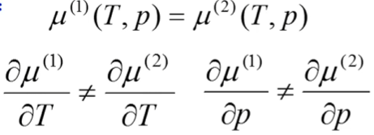

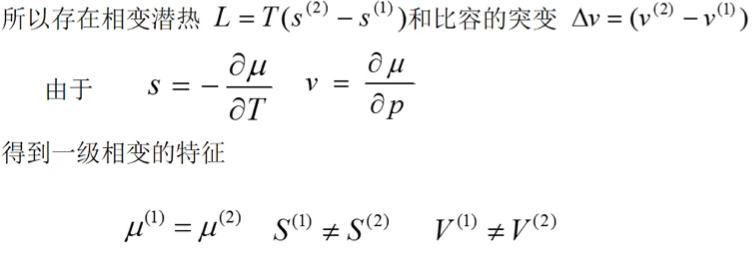

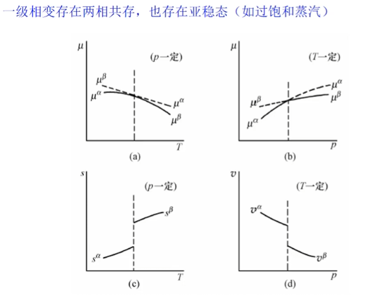

二级相变

相变点处，化学势和化学势的一阶偏导连续，但二阶偏导存在突变

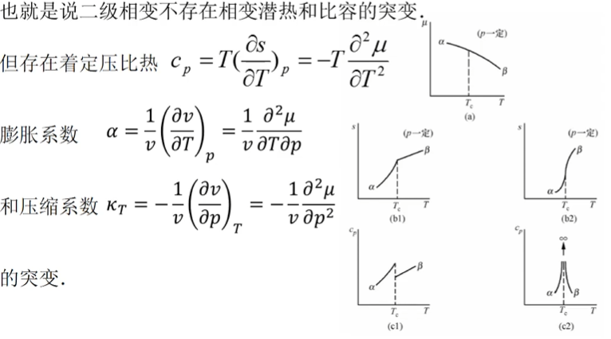

Ehrenfest方程

Clausius-Clapeyron eauation 对二级相变

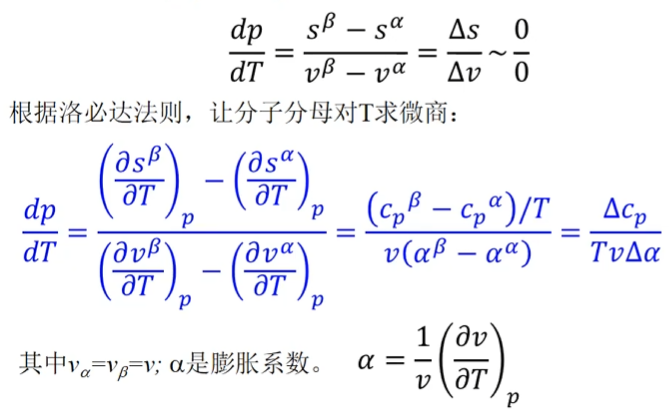

另一种形式：

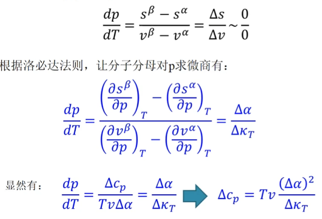

以上为Ehrenfest方案，但实际上发现大部分相变在相变点，化学势的二阶偏微商不是不连续而是发散的。

Fisher方案

化学势和化学势的一阶偏导连续，二阶偏导不连续或者发散，统称为二级相变

N级相变与连续相变：如果相变点两相的化学势及其一阶，二阶知道N-1阶偏

连续，但N阶偏导存在突变，成为N级相变。

二级及以上相变称为连续相变，连续相变在相变点两相的化学势和化学势一阶偏导数连续，因此所有热力学函数都是连续的

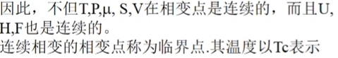

与一级相变不同，连续相变在相变点的每一侧，只有一个相能存在，不允许两相共存和亚稳态存在。在临界点Tc的邻域，有些热力学量表现出趋于无穷到的奇异行为，另外，不同的物质系统在Tc邻域的热力学特征表现出极大的相似性。

朗道连续相变理论

朗道建立了二级相变的一个唯象理论，该理论包含两个重要概念，序参量和对称性破缺。

对称性破缺：当宏观条件变化时，一种或多种对称元素消失，称为对称性破缺

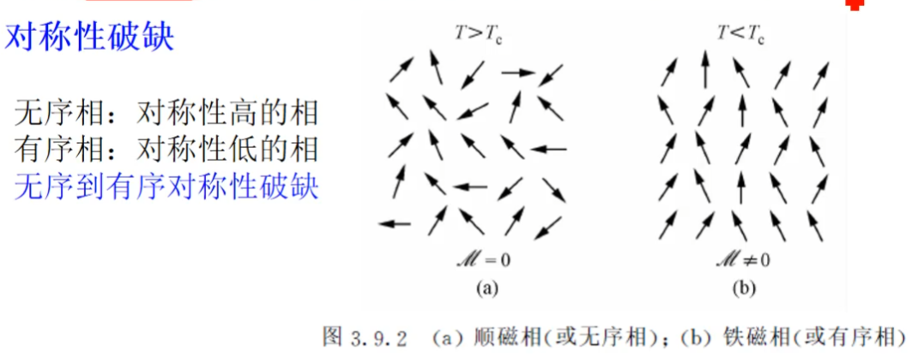

如何理解此处对称性高低：对称性高指在宏观上从任何角度观察，体系的宏观性质表现是相同的。

序参量η

朗道相变理论的根本：相变的根源在于不同相之间的对称性有不同

序参量用于描述系统的有序度，当一个系统从高对称相经连续相变转变到低对称相时，该有序度将从高对称相的0值连续转变到低对称性的非0值

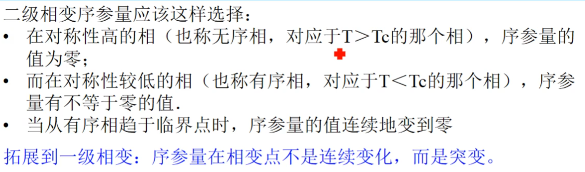

序参量可以有不同类型，可以是标量，矢量，张量，复数等，由物理系统与具体相变决定

序参量作为热力学函数的一个附加变量

相变前后物质的物态方程不同，因此热力学函数有区别。对二级相变，相变前后物质的区别在于序参量的不同，因此将序参量吸收进热力学函数，可以将不同相的热力学函数统一在一起

例如可以用μ(T,p,η)统一表示两项的化学势，可以用F(T,V,M)统一表示顺磁铁磁两相的自由能

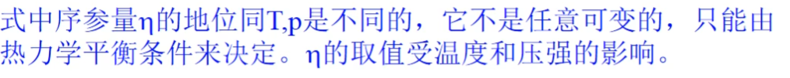

序参量不是一个独立变量

顺磁铁磁相变的朗道理论

单轴各向异性铁磁体材料在外磁场为零时存在一个二级相变，临界温度为Tc。

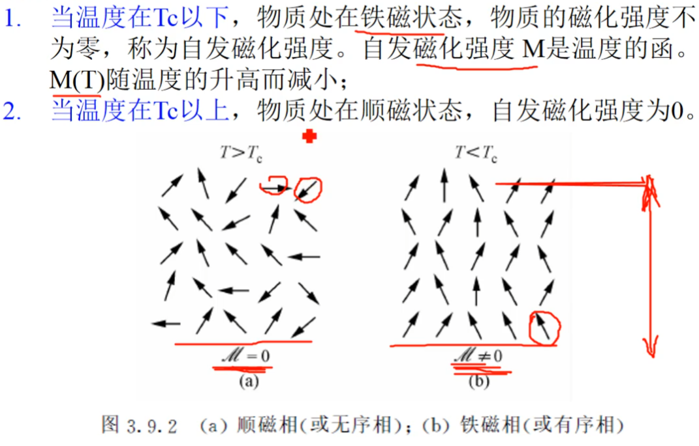

用自由能讨论其二级相变

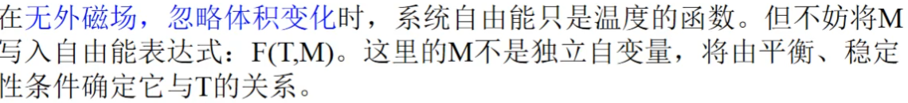

已知M在临界点附近为小量，将自由能在临界点附近对M展开（忽略体积变量）：

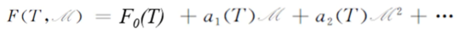

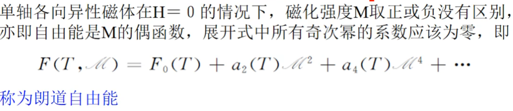

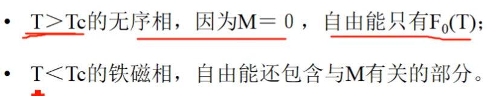

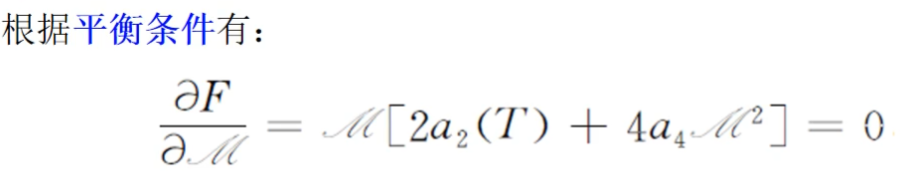

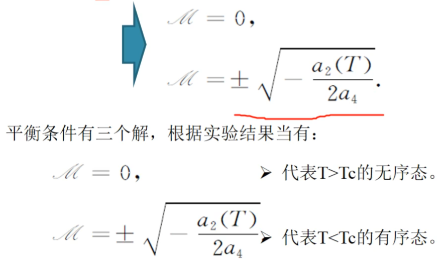

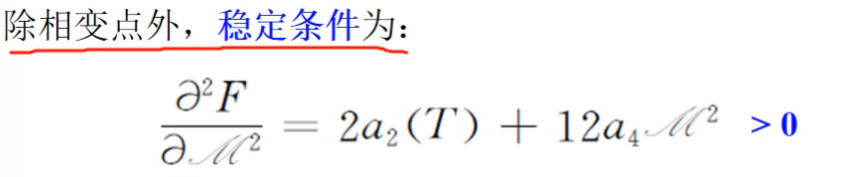

无序态：M=0，代入稳定条件有:T>Tc, a2>0

有序态：M值代入稳定条件有:T<Tc, a2<0,a4>0

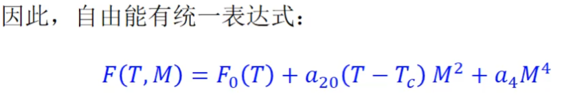

关于系统稳定性：

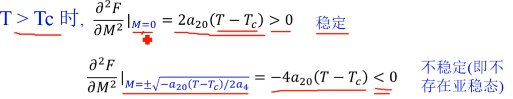

有序相在T>Tc时不存在

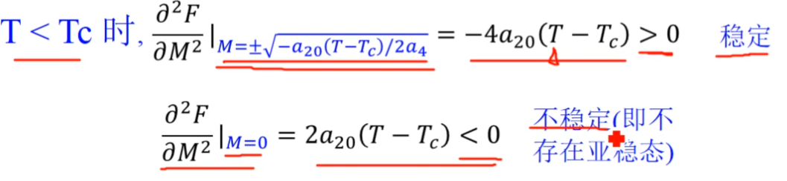

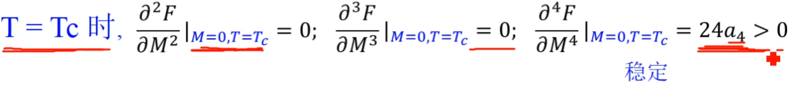

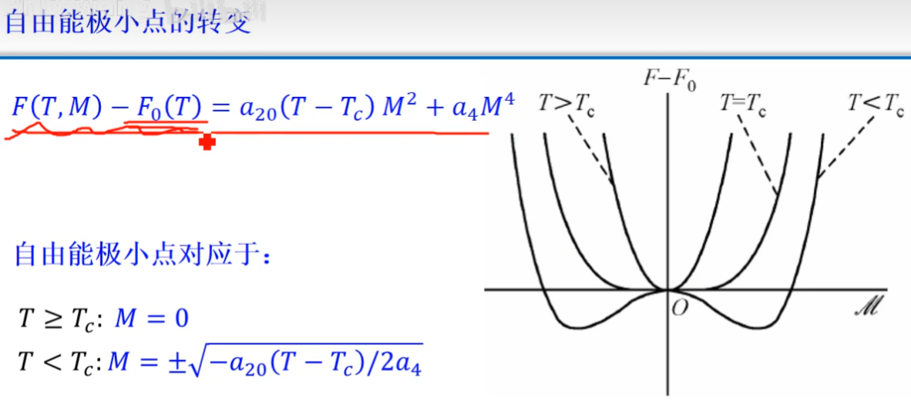

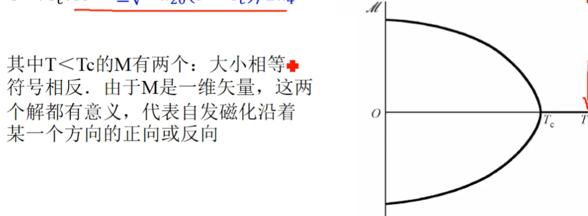

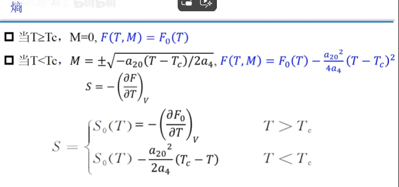

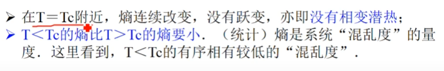

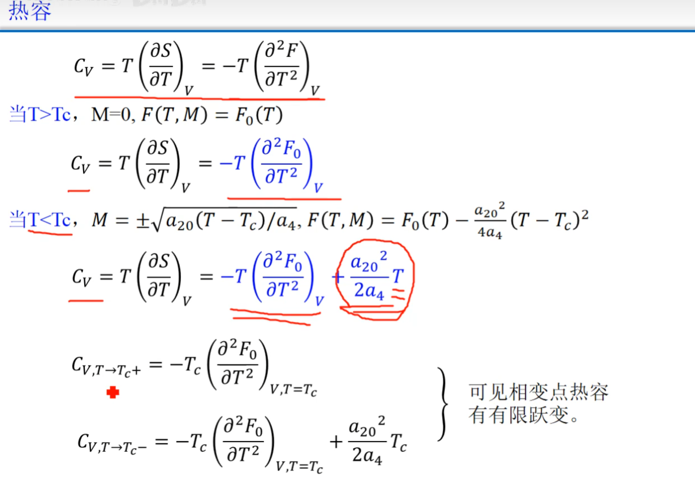